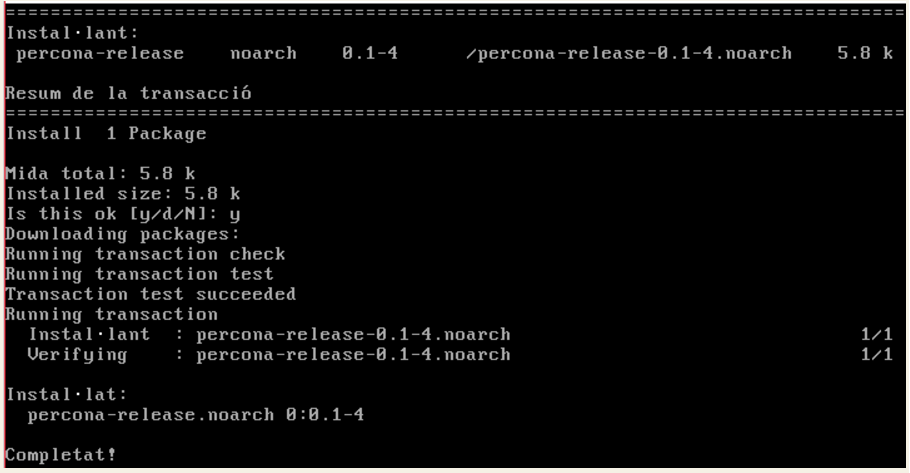
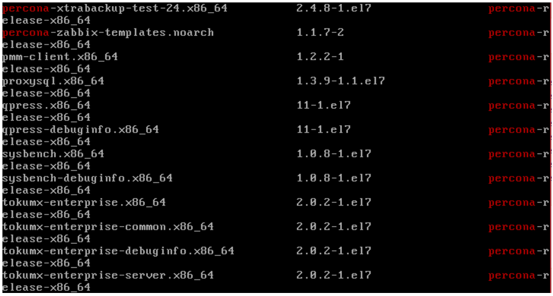
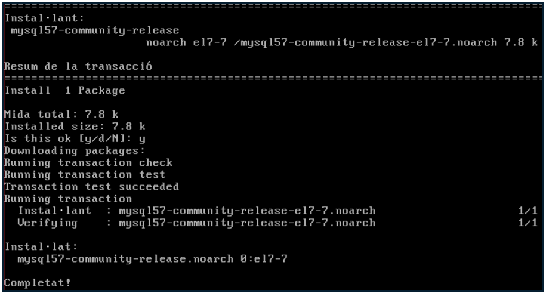
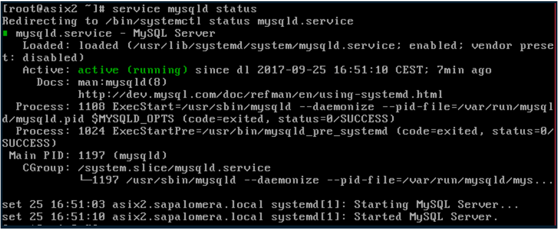
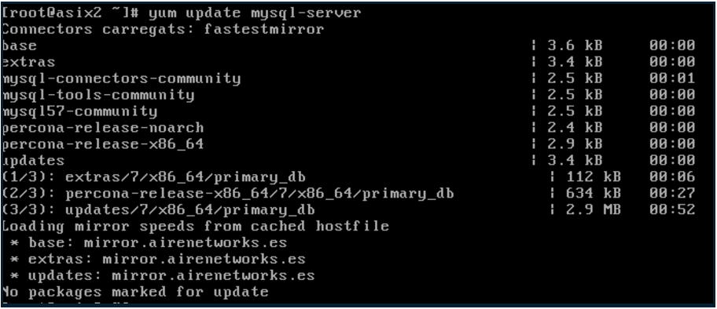

# **Part I - INSTAL·LACIÓ SGBD MySQL Percona** #

## ENUNCIAT ##
Partint d'una màquina CentOS 7 minimal proporcionada pel professor realitza la instal·lació d'un SGBD Percona Server mitjançant el gestor de paquets YUM.

## ENLLAÇOS ##
**Percona Server 5.7 Doc**
<http://www.percona.com/doc/percona-server/5.7>

**Instal·lació Percona Server 5.7via YUM Repository**
<http://www.percona.com/doc/percona-server/5.7/installation/yum_repo.html>

**Instal·lació MySQL via YUM Repository**
<http://www.tecmint.com/install-latest-mysql-on-rhel-centos-and-fedora/>

## **Documentació per la instal·lació** ##
Iniciem sessió:

Escribim: `yum install http://www.percona.com/downloads/percona-release/redhat/0.1-4/percona-release-0.1-4.noarch.rpm`

Per veure si ja estan instal·lats els repositoris fem:
`yum list | grep percona`

Per instal·lar el servidor fem:
`yum install Percona-Server-server-57`

Un cop instal·lat el servidor Percona, l'iniciem.
`service mysql start`

Per descarregar el repositori YUM del MySQL 5.7
`wget http://dev.mysql.com/get/mysql57-community-release-el7-7.noarch.rpm`

Per instal·lar el paquet hem d'escriure:
`yum localinstall mysql57-community-release-el7-7.noarch.rpm`

Per verificar que el repositori s'ha instal·lat correctament:
`yum repolist enabled | grep "mysql.*-community.*"`

Seguidament instal·lem la última versió de MySQL
`yum install mysql-community-server`

Per començar el MySQL Server, un cop s'ha instal·lat tot
`service mysqld start`

Per comprovar l'estat del servidor
`service mysqld status`

Per acabar, verifiquem la versió del MySQL
`mysql --version`

Actualitzar MySQL via YUM
`yum update mysql-server`

Si hi han noves actualitzacions per MySQL, s'instal·laran automàticament.

## **Preguntes a respondre** ##
1. Un cop realitzada la instal·lació realitza una securització de la mateixa. Quin programa realitza aquesta tasca? Realitza una securització de la instal·lació indicant que la contrasenya de root sigui patata.

Per realitzar una securització del MySQL
`grep 'temporary password' /var/log/mysqld.log`

Un cop s'ha generat la nova contrasenya temporal, introduim la comanda per fer una securització del MySQL
`mysql_secure_installation`

Pass: *P@ssw0rd*

Connectar-se al servidor MySQL posant un usuari i contrasenya
`mysql -u root -p`

No ens deixa posar la contrasenya *patata* perquè no compleix els requisits de la política de contrasenyes, per tant l'hem de modificar.
Entrem al mysql i posem `SHOW VARIABLES LIKE 'validate_password%';` perquè ens mostri les variables que hi han que començen en forma de validar la contrasenya.

2. Quines són les instruccions per arrancar / verificar status / apagar servei de la base de dades de Percona Server.
3. A on es troba i quin nom rep el fitxer de configuració del SGBD Percona Server?
4. A on es troben físicament els fitxers de dades (per defecte)
5. Crea un usuari anomenat asix en el sistema operatiu i en SGBD de tal manera que aquest usuari del sistema operatiu no hagi d'introduir l'usuari i password cada vegada que cridem al client mysql?
* http://dev.mysql.com/doc/refman/5.7/en/password-security-user.html
* Usuari SO-→ asix / patata
* Usuari MySQL → asix / patata
6.	El servei de MySQL (mysqld) escolta al port 3306. Quina modificació/passos caldrien fer per canviar aquest port a 33306 per exemple? Important: No realitzis els canvis. Només indica els passos que faries.
